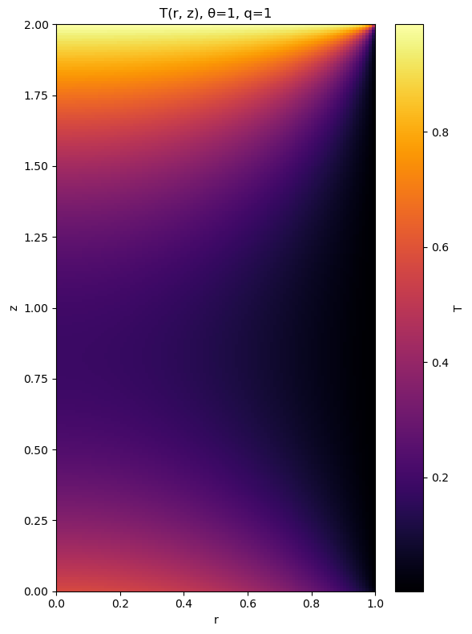
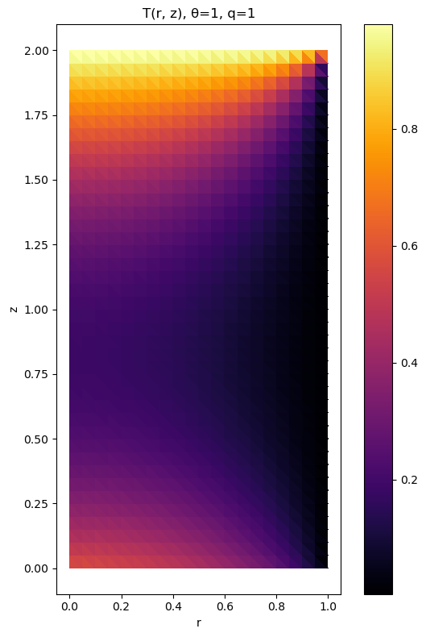
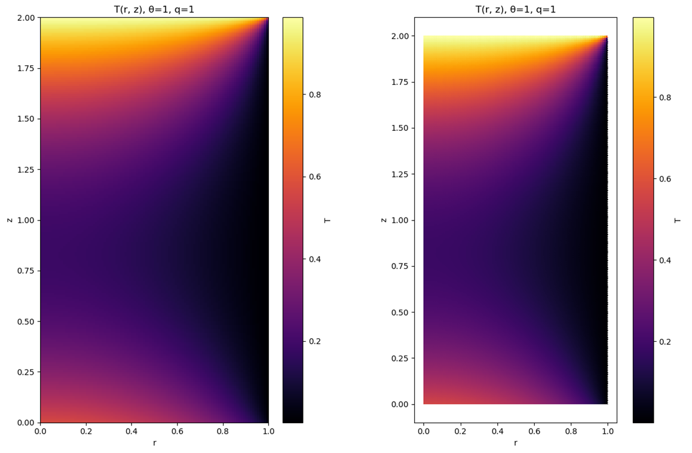
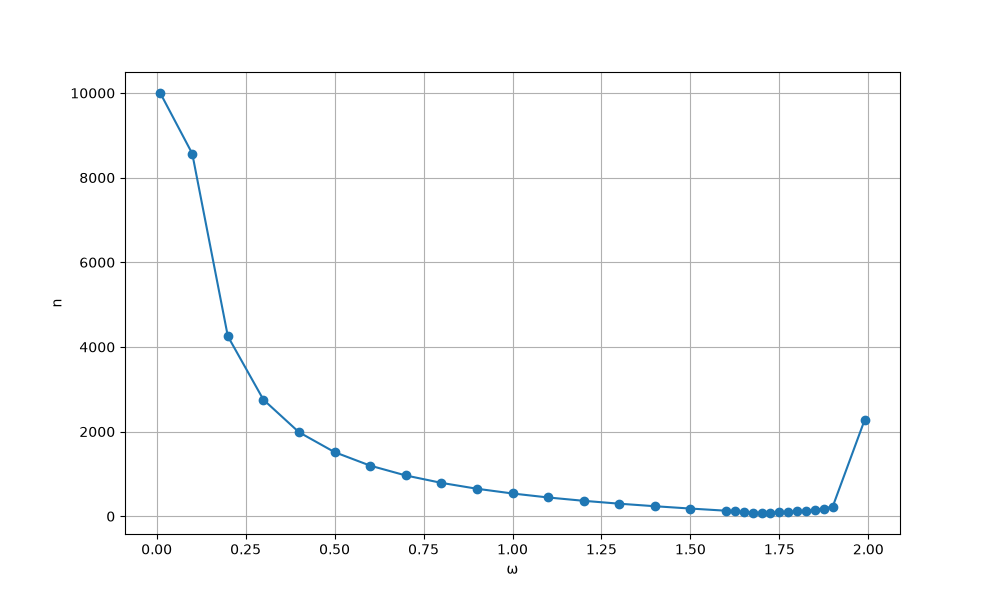
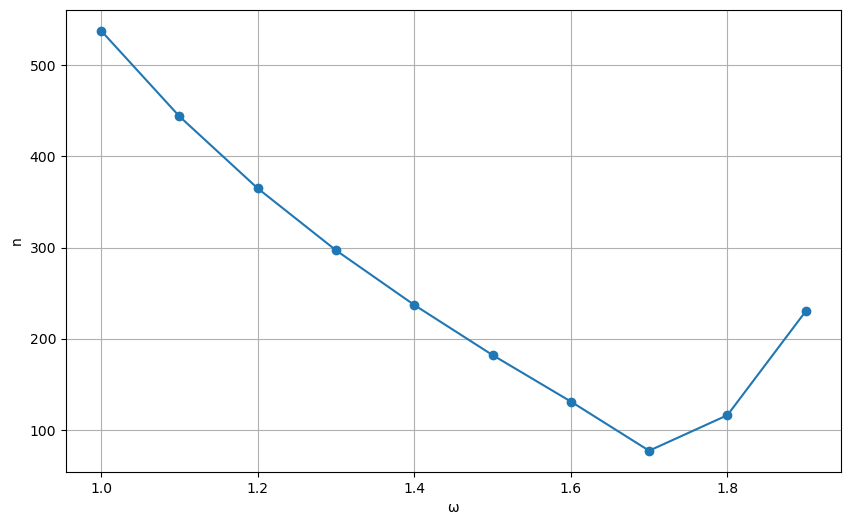

# Стационарная теплопроводность на треугольной сетке (FDM и FVM)

Рассмотрим конечный однородный цилиндр радиуса $a$ и длины $l$. Если граничные условия не зависят от азимутального угла $\varphi$, то задача сводится к двумерной:

$$ \frac{1}{r}\frac{\partial}{\partial{r}}\left(kr\frac{\partial{T}}{\partial{r}}\right)+\frac{\partial}{\partial{z}}\left(k\frac{\partial{T}}{\partial{z}}\right)=-f, $$ 
$$ 0 < r < a, $$
$$ 0 < z < l. $$

Поставим следующие граничные условия:

$$ T = T_1 \text{ при } r = a, $$

$$ T = T_2 \text{ при } z = l, $$

$$ -k \frac{dT}{dz} = q \text{ при } z = 0. $$

$$ \frac{dT}{dr} = 0 \text{ при } r = 0. $$

Обезразмеренная задача имеет вид:

$$ \frac{1}{\hat r}\frac{\partial}{\partial \hat r} \left(\hat r \frac{\partial \hat T}{\partial \hat r}\right) + \frac{\partial^{2} \hat T}{\partial \hat z^{2}}= -\hat f = -\frac{a^{2} f}{k T_{1}}, $$ 
$$ 0 < \hat r < 1, $$ 
$$ 0 < \hat z < \frac{l}{a} $$

со следующими граничными условиями:

$$ \frac{d \hat T}{d \hat r} = 0 \text{ при } \hat r = 0, $$
$$ \hat T = 0 \text{ при } \hat r = 1, $$
$$ \frac{d \hat T}{d \hat z} = -\hat q = -\frac{a q}{k T_{1}} \text{ при } \hat z = 0, $$
$$ \hat T = \theta = \frac{T_{2} - T_{1}}{T_{1}} \text{ при } \hat z = \frac{l}{a}. $$

Итого решаем данную задачу двумя методами (при $\frac{l}{a}=2$, $q=1$, $\theta=1$).

FDM results (сетка $100\times200$, решается через np.linalg.solve())

  

FVM results (сетка $20 \times 40$, решается методом верхней релаксации)

  

Обе задачи, решенные через np.linalg.solve()) с сеткой $100\times200$

  

Для обеспечения наивысшей скорости нахождения решения в дальнейшем, проведем исследования на наилучший параметр $\omega_{opt}$ (для исследования использовалась сетка $10\times 20$): 

  

Итоговый результат: $\omega_{opt}=1.7 \text{ при } n = 77 $

Для FVM аналогично

  

