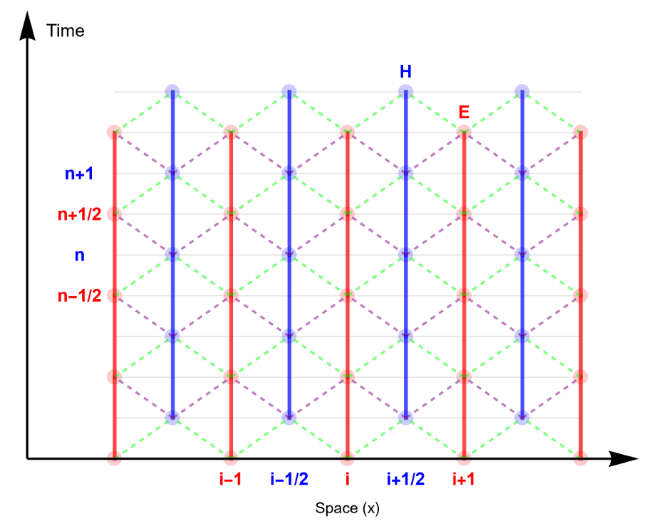
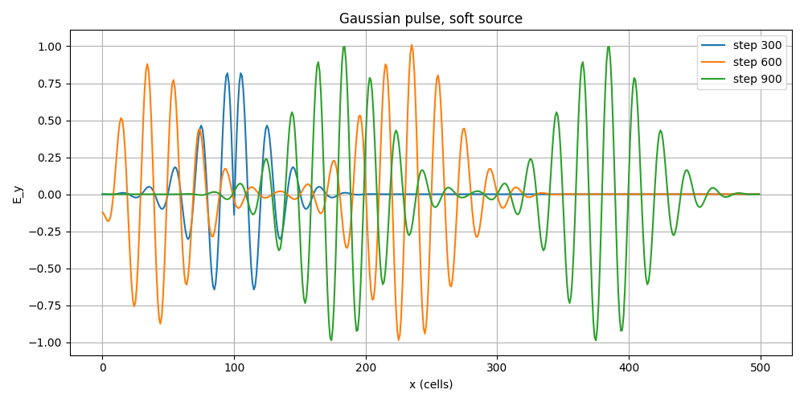
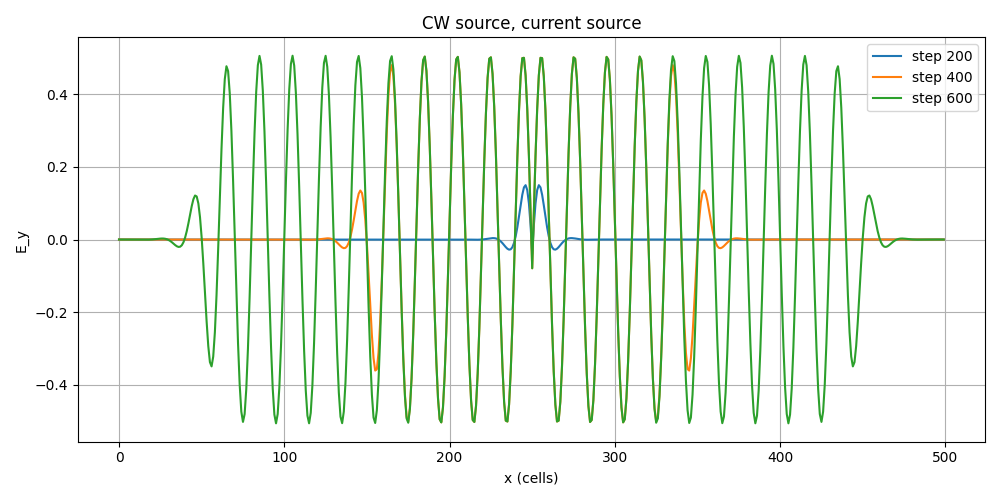

# Введение в вычислительную электродинамику. Метод FDTD
Для моделирования FDTD (finite-difference time-domain) метода использовался алгоритм на сетке Yee, в котором электрическое поле задается в точках $(x_i,t_{n+1/2})$,  магнитное поле задается в точках $(x_{i+1/2},t_n)$, то есть сетка имеет вид:

  

Пропустив вывод алгоритма Yee, перейдем к его итоговым выражениям:

$$ E_y|_i^{n+1/2}=C_{a,i}E_y|_i^{n-1/2}+C_{b,i}\left(H_z|_{i-1/2}^n-H_z|_{i+1/2}^n+\Delta x J_y|_i^n\right) $$
$$H_z|_{i+1/2}^{n+1}=D_{a,i+1/2}H_z|_{i+1/2}^{n}+D_{b,i+1/2}\left(E_y|_i^{n+1/2}-E_y|_{i+1}^{n+1/2}-\Delta x M_z|_{i+1/2}^{n+1/2}\right)$$
$$C_{a,i}=\frac{2 \varepsilon_i - \sigma_i \Delta t}{2 \varepsilon_i + \sigma_i \Delta t}, \qquad C_{b,i}=\frac{2 \Delta t}{\Delta x(2 \varepsilon_i + \sigma_i \Delta t)}$$
$$D_{a,i+1/2}=\frac{2 \mu_{i+1/2} - \sigma_{i+1/2}^* \Delta t}{2 \mu_{i+1/2} + \sigma_{i+1/2}^* \Delta t}, \qquad D_{b,i+1/2}=\frac{2 \Delta t}{\Delta x(2 \mu_{i+1/2} + \sigma_{i+1/2}^* \Delta t)}$$

### Задание 0
Для данного задания (после реализации 1D FDTD в свободном пространстве) необходимо реализовать два вида источников при двух способах их задания. В работе использовались:
* источник непрерывного излучения (CW source)

$$ f(t)=g(t) \sin(\omega_p t)=g(t) \sin(2 \pi f_p t) $$
$$g(t)=\frac12\left[1+\tanh(\frac{t}{\omega}-s)\right]$$
* Гауссов импульс

$$f(t)=g(t) \exp\left[-\frac{(t-t_0)^2}{2 \omega^2}\right]\sin(2\pi f_pt)$$
$$g(t)=\theta(t-t_{start})-\theta(t-t_{finish})$$

Для задания источника были использованы:
* "Мягкий" источник (Soft Source) 
На каждом шаге по времени к существующему полю добавляется поле источника.
* Ток (Current Source)
Возбуждение вводится через плотность тока $J$.

Рассмотрим получившиеся графики:

  

  

  

  

  

Источники отличаются. Мягкий источник просто добавляет своё поле к уже существующему $E_y$​, поэтому рядом с источником видно «наслоение»: падающая волна и отражённая волна складываются с полем источника, амплитуда получается больше, форма немного искажена. Токовый источник, вводимый через плотность тока $J$, действует как физически более корректное возбуждение: он запускает волну, но не навязывает жёсткое значение поля в узле. В результате поле около источника менее искажено.

