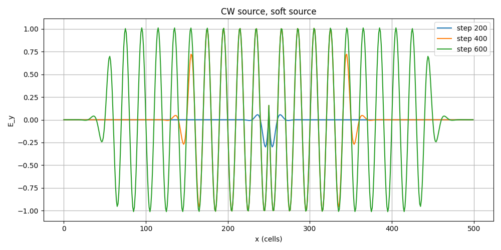
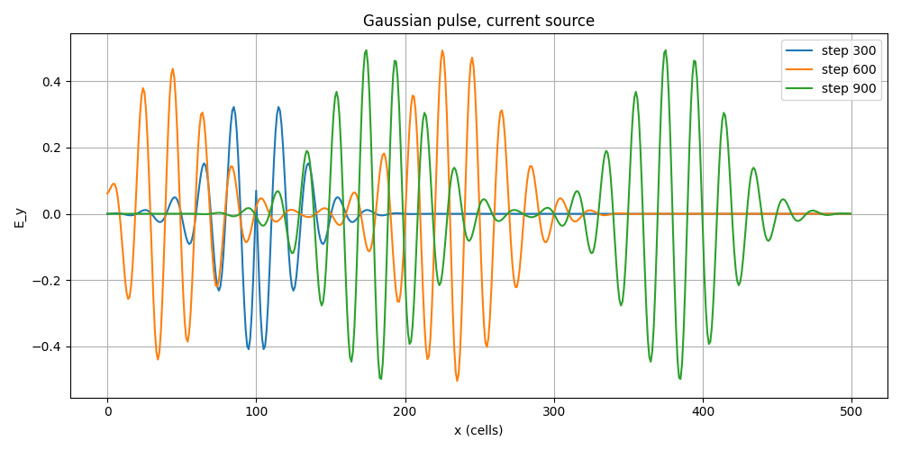
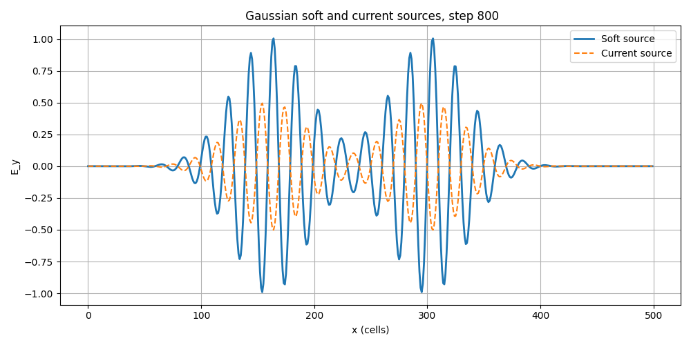
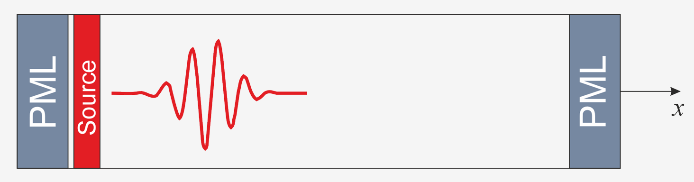
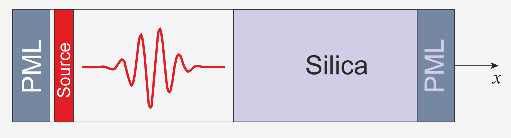
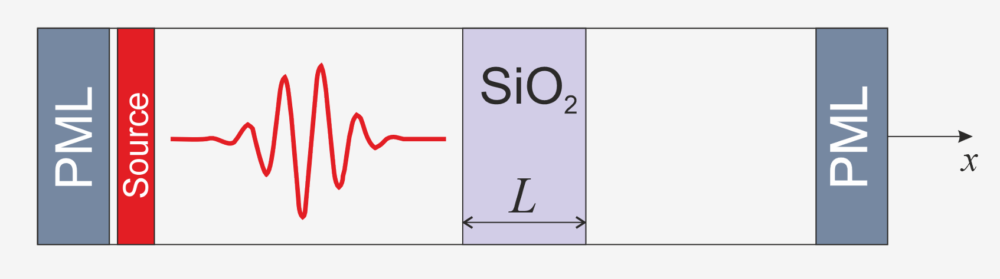
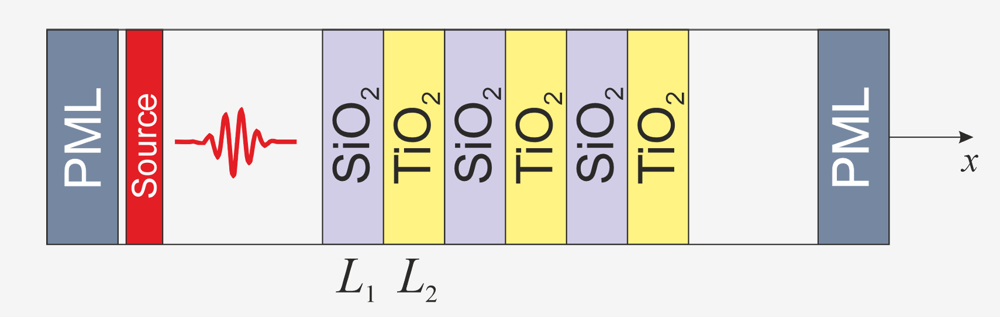
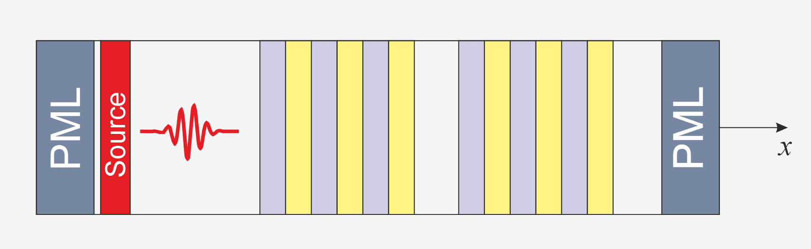

# Введение в вычислительную электродинамику. Метод FDTD
Для моделирования FDTD (finite-difference time-domain) метода использовался алгоритм на сетке Yee, в котором электрическое поле задается в точках $(x_i,t_{n+1/2})$,  магнитное поле задается в точках $(x_{i+1/2},t_n)$, то есть сетка имеет вид:

  

Пропустив вывод алгоритма Yee, перейдем к его итоговым выражениям:

$$ E_y|_i^{n+1/2}=C_{a,i}E_y|_i^{n-1/2}+C_{b,i}\left(H_z|_{i-1/2}^n-H_z|_{i+1/2}^n+\Delta x J_y|_i^n\right) $$
$$H_z|_{i+1/2}^{n+1}=D_{a,i+1/2}H_z|_{i+1/2}^{n}+D_{b,i+1/2}\left(E_y|_i^{n+1/2}-E_y|_{i+1}^{n+1/2}-\Delta x M_z|_{i+1/2}^{n+1/2}\right)$$
$$C_{a,i}=\frac{2 \varepsilon_i - \sigma_i \Delta t}{2 \varepsilon_i + \sigma_i \Delta t}, \qquad C_{b,i}=\frac{2 \Delta t}{\Delta x(2 \varepsilon_i + \sigma_i \Delta t)}$$
$$D_{a,i+1/2}=\frac{2 \mu_{i+1/2} - \sigma_{i+1/2}^* \Delta t}{2 \mu_{i+1/2} + \sigma_{i+1/2}^* \Delta t}, \qquad D_{b,i+1/2}=\frac{2 \Delta t}{\Delta x(2 \mu_{i+1/2} + \sigma_{i+1/2}^* \Delta t)}$$

### Задание 0
Для данного задания (после реализации 1D FDTD в свободном пространстве) необходимо реализовать два вида источников при двух способах их задания. В работе использовались:
* источник непрерывного излучения (CW source)

$$ f(t)=g(t) \sin(\omega_p t)=g(t) \sin(2 \pi f_p t) $$
$$g(t)=\frac12\left[1+\tanh(\frac{t}{\omega}-s)\right]$$
* Гауссов импульс

$$f(t)=g(t) \exp\left[-\frac{(t-t_0)^2}{2 \omega^2}\right]\sin(2\pi f_pt)$$
$$g(t)=\theta(t-t_{start})-\theta(t-t_{finish})$$

Для задания источника были использованы:
* "Мягкий" источник (Soft Source) 
На каждом шаге по времени к существующему полю добавляется поле источника.
* Ток (Current Source)
Возбуждение вводится через плотность тока $J$.

Рассмотрим получившиеся графики:

  

  

  

  

  

Источники отличаются. Мягкий источник просто добавляет своё поле к уже существующему $`E_y`$​, поэтому рядом с источником видно «наслоение»: падающая волна и отражённая волна складываются с полем источника, амплитуда получается больше, форма немного искажена. Токовый источник, вводимый через плотность тока $`J`$, действует как физически более корректное возбуждение: он запускает волну, но не навязывает жёсткое значение поля в узле. В результате поле около источника менее искажено.

#### Задание 1

  

В данном задании рассматривается свободное пространство, сопровождаемое двумя PML слоями. Мы рассматриваем PML слой с постоянным, квадратичным и кубическим профилем и строим для него графики:

![[reflection_pml_const.png]]
![[max_reflection_pml.png]]
Рассматривая получившиеся графики, можно отметить для постоянной ширины PML при увеличении порядка профиля уменьшается и  значение коэффициента отражения (для постоянного профиля (в середине) - $10^{-3}-10^{-2}$, для квадратичного - $10^{-6}-10^{-5}$, для кубического - чуть меньше квадратичного).
Для графика с зависимостью от ширины PML имеем примерно такую же характеристику: ранжировка для степеней профилей остается прежней, также при увеличении ширины - уменьшается коэффициент отражения.

### Задание 2

  

Правая часть расчетной области заполнена кварцем ($n = 1.45$). Построим зависимость коэффициента отражения и поглощения от длины волны:
![[Pasted image 20260602180122.png]]
($dx = 10 нм$, $Ndomain = 400$, $pmlN = 40$, $Ntotal = Ndomain + 2*pmlN$, $mon_{ref} = pmlN + 100$, $mon_{trans} = interface_{pos} + 50$)
Полученные численно значения коэффициентов отражения и поглощения хорошо согласуются с теоретическими значениями.

### Задание 3

  

Теперь в центр расчетной области помещается кварцевая пластина длиной L=200 нм. Для нее строятся графики зависимости коэффициентов отражения и пропускания в зависимости от длины волны, от толщины пластины, а также рассматривается зависимость результатов от времени моделирования. Для данных случаев построены соответствующие графики:
![[quartz_slab_const_l.png]]
![[quartz_slab_diff_l.png]]
![[quartz_slab_results.png]]
Для полученных результатов можно отметить, что на первом графике полученные значения хорошо согласуются с теорией, при изменении толщины пластины максимальное значения коэффициента отражения остается одинаковым, изменяется только положение и количество максимумов и минимумов. На графике с различными временами моделирования можно отметить такую закономерность: при увеличении числа шагов численная картина все больше согласуется с теорией.

### Задание 4

  

В данном задании рассматривалось распространение поля в периодической диэлектрической структуре, период которой состоит из 2 материалов, таких как $TiO_2$ ($n = 2.28$) и $SiO_2$ ($n = 1.45$). Были рассчитаны и построены спектры отражения и пропускания фотонного кристалла в видимом диапазоне:
* с толщиной слоев для обоих 100 нм
* слои с равной оптической толщиной, например, 100нм для слоя $SiO_2$ и 55 нм для $TiO_2$
Также были проведены исследования зависимости спектров отражения от количества периодов.
![[photonic_crystal_100_100.png]]
![[photonic_crystal_100_55.png]]![[photonic_crystal_both.png]]
В случае одинаковой физической толщины слоёв (100/100 нм) появляется широкая область почти полного отражения в видимом диапазоне — фотонная запрещённая зона, где из‑за многократных отражений и интерференции волна не проходит через структуру. При одинаковой оптической толщине ($SiO_2$ - 100 нм, $TiO_2$ - 55 нм) запрещённая зона становится более симметричной и центрируется около расчётной длины волны, соответствующей четвертьволновому условию, поэтому структура ведёт себя как более «идеальное» диэлектрическое зеркало.
Увеличение числа периодов приводит к росту максимального отражения и расширению запрещённой зоны, а также к сужению резонансных пиков вне полосы запрета, что соответствует усилению интерференционных эффектов в более длинном фотонном кристалле.

### Задание 5

  

В данном задании рассматривалась брэгговская микрополость — воздушная диэлектрическая полость, заключённая между двумя фотонными кристаллами из чередующихся слоёв $TiO_2$ и $SiO_2$. Для расчётов была выбрана центральная длина волны 650 нм, толщины слоёв задавались по четвертьволновому условию, а толщина воздушной полости принималась равной $\lambda_0/2$. Также были построены спектры для двух конфигураций: 4 и 8 периодов с каждой стороны.
![[bragg_cavity_4.png]]
![[bragg_cavity_8.png]]
На спектрах отражения и пропускания наблюдается фотонная запрещённая зона, внутри которой появляется узкий пик пропускания, связанный с резонансной модой микрополости. При увеличении числа периодов отражение в запрещённой зоне становится выше, а резонансный пик — уже, что соответствует лучшей локализации поля и большей добротности структуры.
![[bragg_cavity_and_photonic_crystal.png]]
Сравнение с чисто периодической структурой показывает, что без центральной полости в запрещённой зоне пропускание практически отсутствует. Добавление воздушного дефекта приводит к появлению локализованной моды и узкого канала прохождения внутри полосы запрета. Брэгговская микрополость отличается от обычного фотонного кристалла появлением узкой резонансной линии пропускания внутри запрещённой зоны и локализацией электромагнитного поля в области полости. Увеличение числа периодов усиливает зеркальные свойства структуры и делает резонанс более выраженным.
