# Введение в вычислительную гидродинамику. Стационарное уравнение адвекции-диффузии

**Стационарное уравнение адвекции-диффузии: FVM**

 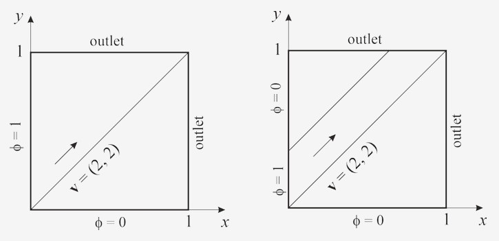 

Решается уравнение адвекции-диффузии:

$$ \mathop{\text{div}}(\rho v \varphi) = \mathop{\text{div}}(\Gamma \nabla \varphi) + S $$

далее реализуется метод конечных объемов на прямоугольной (квадратной) сетке.

## Задача 1

 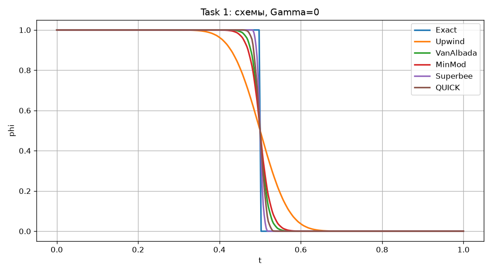 

Сравнение профилей при $\Gamma=0$ показывает, что схема Upwind значительно размывает фронт из‑за высокой численной диффузии. TVD‑схемы с ограничителями VanAlbada, MinMod, Superbee и QUICK дают существенно более крутой переход от $\phi=1$ к $\phi=0$ и лучше согласуются с аналитическим решением, причём ограничители с более сильной антидиффузией (Superbee, QUICK) обеспечивают наибольшую резкость фронта, но потенциально обладают более сложной сходимостью нелинейного итерационного процесса.

 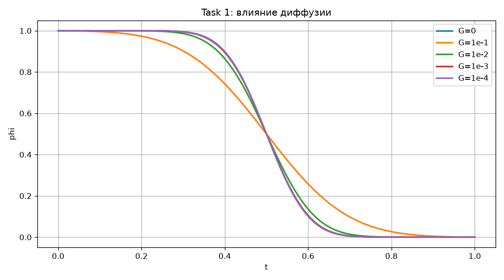 

Исследование влияния коэффициента диффузии $\Gamma$ показало, что при увеличении $\Gamma$ фронт неизбежно сглаживается: зона перехода становится шире, а максимальный градиент уменьшается. При малых значениях $\Gamma$ (до $10^{-3}$) профиль остаётся близок к решению чисто адвективной задачи, тогда как при $\Gamma=10^{-1}$ распределение $\phi$ становится существенно более плавным и приближённым к линейному. Двумерные карты $\phi(x,y)$ наглядно демонстрируют смещение и растяжение слоя смешения вдоль направления потока по мере роста диффузии.

 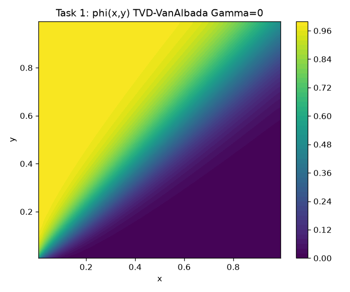 

 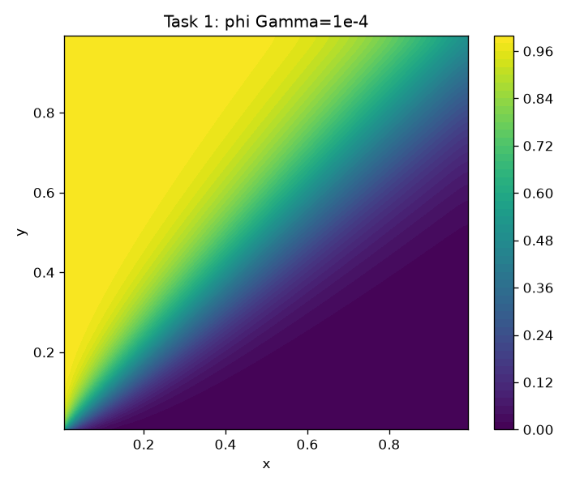 

 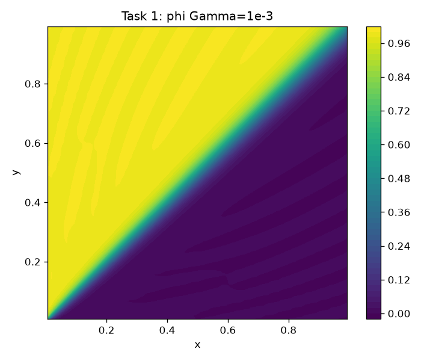 

 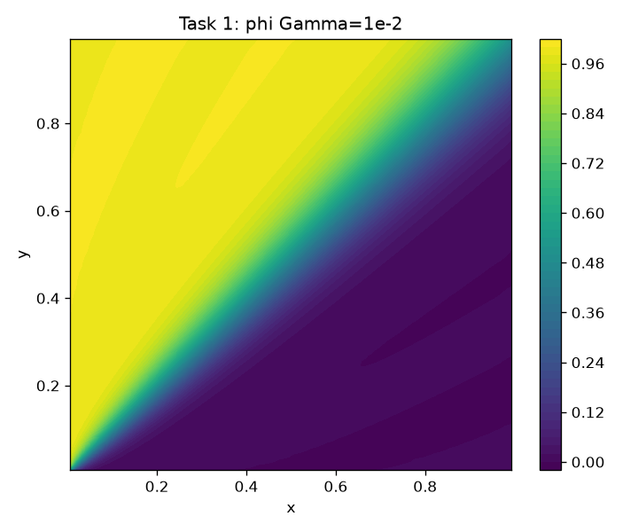 

 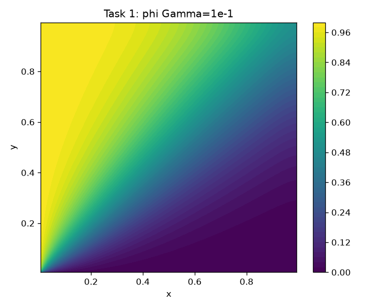 

#### Задача 2

 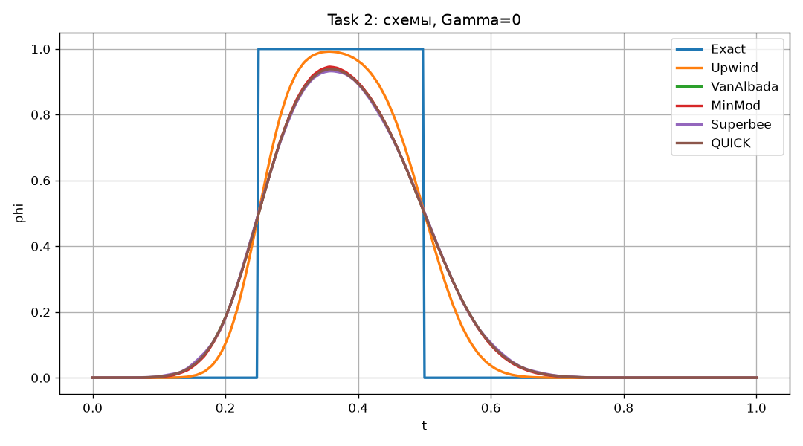 

Сечения вдоль диагонали показывают, что upwind-схема сильно сглаживает форму импульса, тогда как TVD‑схемы позволяют существенно лучше сохранить прямоугольный характер профиля и положение фронтов.

 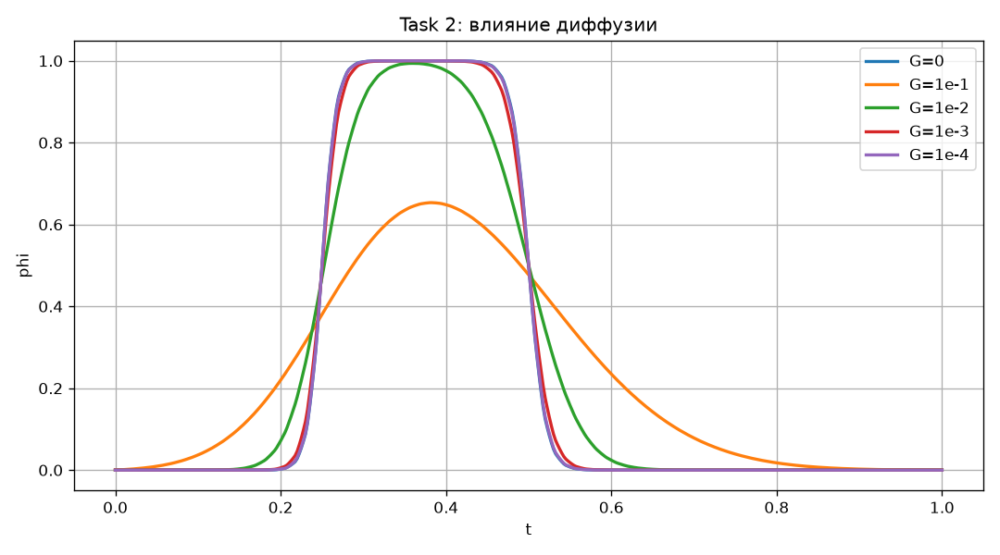 

С увеличением коэффициента диффузии импульс заметно сглаживается (что хорошо видно на двумерных распределениях $`\phi(x,y)`$ при различных значениях диффузии): максимум $`\phi`$
уменьшается, а его ширина по $`t`$ растёт; при малых $`\Gamma`$ форма профиля близка к чисто адвективной, при $`\Gamma=10^{−1}`$ импульс становится значительно более пологим.

 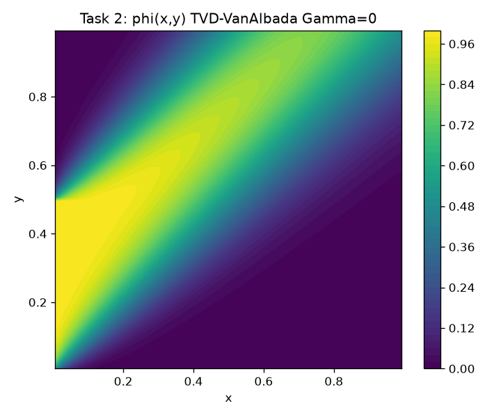 

 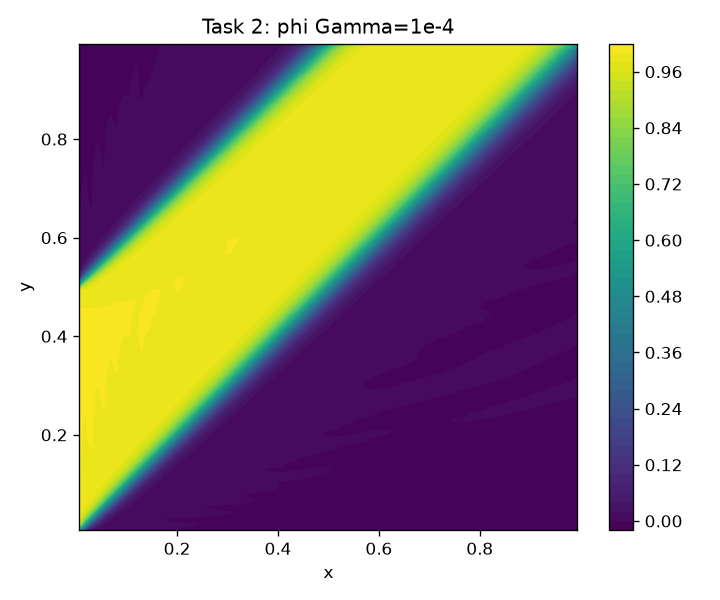 

 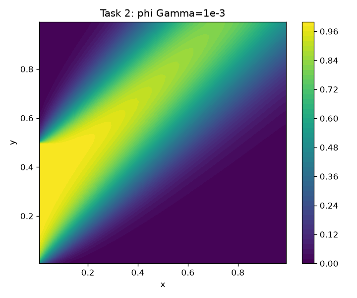 

 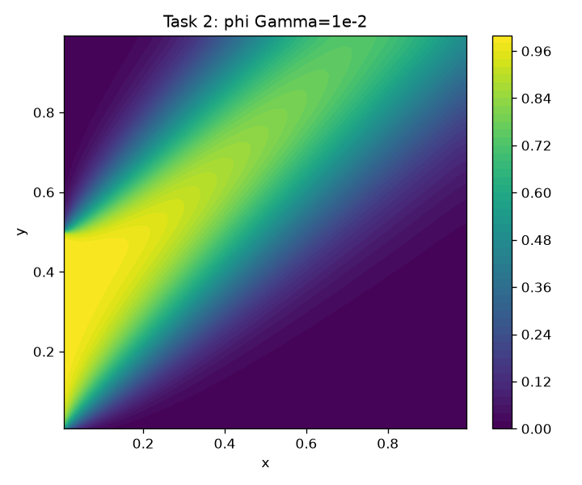 

 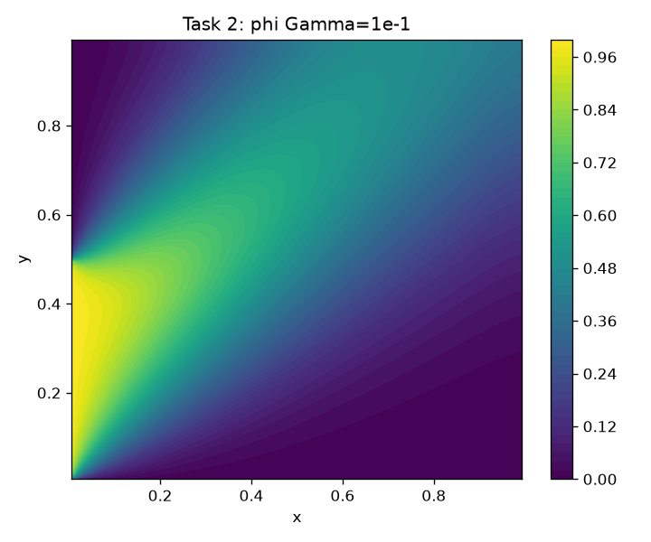 

В целом численные эксперименты подтверждают, что TVD‑подход позволяет резко снизить численную диффузию по сравнению со схемой Upwind и корректно воспроизводить резкие градиенты и разрывы решения. При этом введение физической диффузии $\Gamma>0$ ожидаемо сглаживает фронты и улучшает устойчивость и сходимость расчёта, но неизбежно ухудшает разрешение структур потока.
