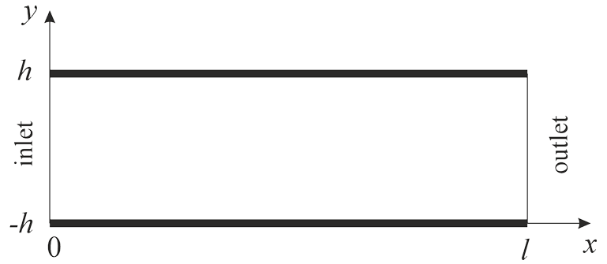
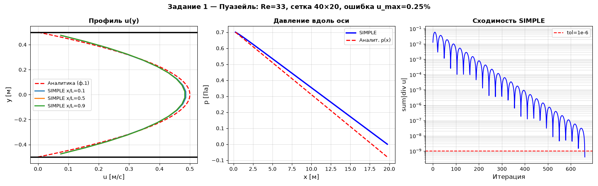
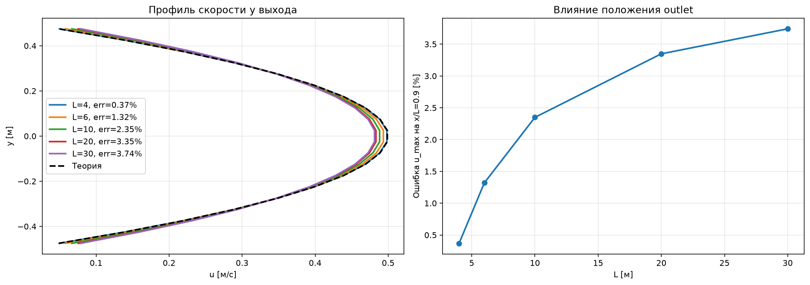
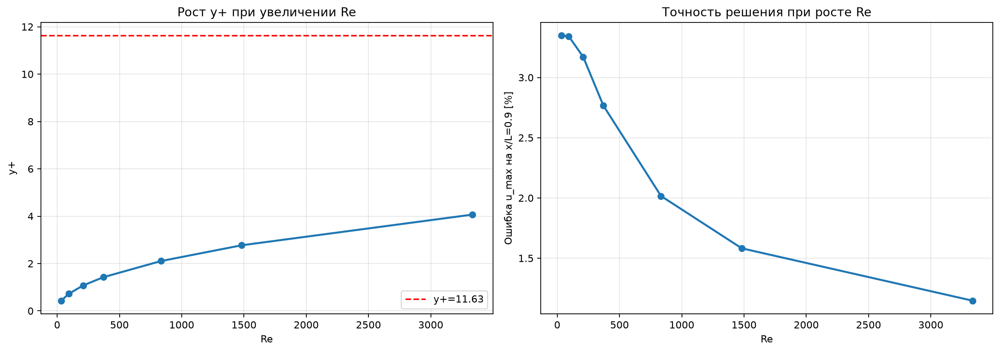

# Введение в вычислительную гидродинамику. Стационарное течение вязкой несжимаемой жидкости

Рассмотрим задачу о течении вязкой несжимаемой жидкости между двумя плоскостями $y = ±h$.

  

Установившееся вертикальное распределение скорости можно аналитически найти из уравнений Навье–Стокса:
$$\upsilon=\frac{h^2\Delta p}{2 \mu l}\left[1-\left(\frac{y}{h}\right)^2 \right]$$
Максимальная скорость достигается при y = 0 и равна
$$\upsilon_{max}=\frac12 \frac{h^2\Delta p}{\mu l}$$
а средняя по сечению скорость составляет
$$\upsilon_{ср}=\frac23\upsilon_{max}$$
Число Рейнольдса для данной задачи определим как
$$Re=\frac{\upsilon_{ср}2h}{\nu}$$
#### Задача 1.
Был реализован метод конечных объемов на прямоугольной сетке со смещенными скоростями и давлениями. Для примера была решена задача на прямоугольной стеке $(40\times20)$ при малом числе Рейнольдса $Re≈33$.

  

При изменении расстояния до outlet l, получаем следующую картину

  

То есть при уменьшении длины l решение становится ближе к теории.

При увеличении Re получаем следующую зависимость:

  

Видно, что y⁺ растёт с Re, но во всех проведённых расчётах остаётся значительно ниже критического 11.63; при этом ошибка $u_{max}$ у выхода даже уменьшается с ростом Re. Если y⁺>11.63 - поток станет турбулентным и придется по другому учитывать стеночные функции.
